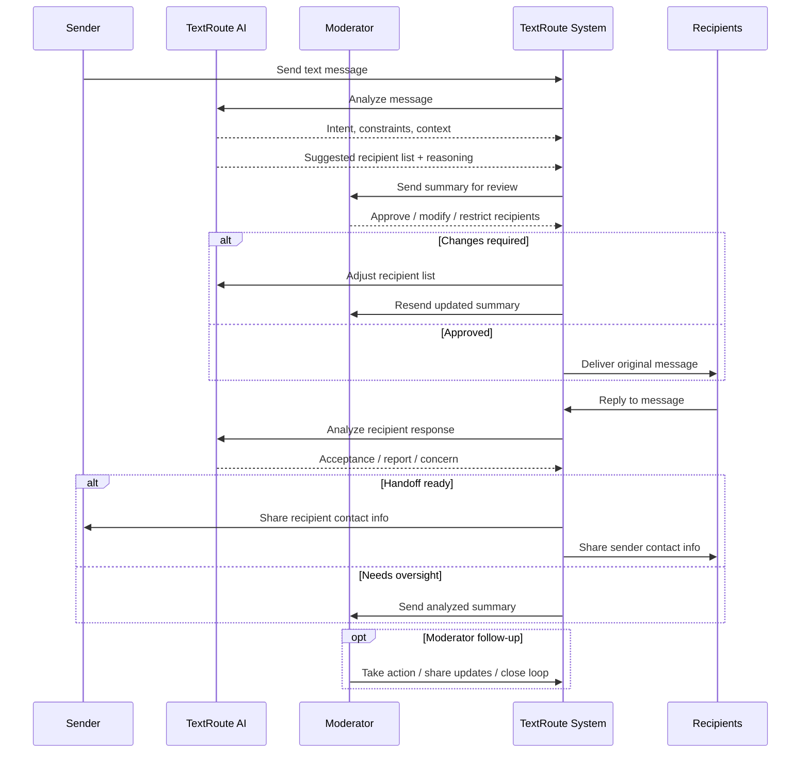

```mermaid
sequenceDiagram
    participant User as Sender
    participant AI as TextRoute AI
    participant Mod as Moderator
    participant Sys as TextRoute System
    participant Rec as Recipients

    User->>Sys: Send text message
    Sys->>AI: Analyze message
    AI-->>Sys: Intent, constraints, context
    AI-->>Sys: Suggested recipient list + reasoning

    Sys->>Mod: Send summary for review
    Mod-->>Sys: Approve / modify / restrict recipients

    alt Changes required
        Sys->>AI: Adjust recipient list
        Sys->>Mod: Resend updated summary
    else Approved
        Sys->>Rec: Deliver original message
    end

    Rec->>Sys: Reply to message
    Sys->>AI: Analyze recipient response
    AI-->>Sys: Acceptance / report / concern

    alt Handoff ready
        Sys->>User: Share recipient contact info
        Sys->>Rec: Share sender contact info
    else Needs oversight
        Sys->>Mod: Send analyzed summary
    end

    opt Moderator follow-up
        Mod->>Sys: Take action / share updates / close loop
    end
```
